# Transfer CloudWatch Logs to S3 via Firehose

> [!IMPORTANT]
> Don't forget to clean up resources after testing to avoid unnecessary AWS charges. See [Cleanup](#cleanup) section.

This project demonstrates how to utilize CloudWatch Logs and Firehose to transfer logs from an EC2 instance to S3 using AWS CloudFormation.

```mermaid
architecture-beta
    group vpc(logos:aws-vpc)[VPC]

    group public_subnet[Public Subnet] in vpc

    service ec2(logos:aws-ec2)[Log Server in Go] in public_subnet

    service igw(logos:aws-vpc)[Internet Gateway]
    service cwl(logos:aws-cloudwatch)[CloudWatch Logs]
    service firehose(logos:aws-kinesis)[Firehose]
    service s3(logos:aws-s3)[S3 Bucket]

    ec2:R --> L:cwl
    cwl:R --> L:firehose
    firehose:R --> L:s3
    igw:B <--> T:ec2
```



## Project Overview

This project consists of two main components:

1. **Go Application Server**
   - Simple HTTP server written in Go
   - Generates structured logs using Zap logger
   - Logs are written when access endpoints `/` and `/about`

2. **AWS Infrastructure (CloudFormation)**
   - VPC with public subnet
   - EC2 instance running a Go server
   - CloudWatch Logs group
   - Firehose for log delivery
   - CloudWatch Logs → Firehose (via Subscription Filter)
   - S3 bucket for log storage
   - Necessary IAM roles and policies

## Prerequisites

1. **AWS Account Setup**
   - Create an IAM user with administrative permissions
   - Enable MFA for security (optional)
   - Get your access key and secret key

2. **Install AWS CLI**
   ```bash
   # Install AWS CLI (commands vary by OS)
   brew install awscli  # For macOS

   # Configure AWS CLI
   # **Create a IAM user with AdministratorAccess before running this command**
   aws configure
   # Enter your:
   # - AWS Access Key ID
   # - AWS Secret Access Key
   # - Default region (e.g., ap-northeast-1)
   # - Default output format (yaml)
   ```

3. **Create EC2 Key Pair**
   ```bash
   # Create a new key pair
   aws ec2 create-key-pair \
     --key-name go-server-key \
     --query 'KeyMaterial' \
     --output text > go-server-key.pem

   # Set correct permissions
   chmod 400 go-server-key.pem
   ```

## Deployment Steps

1. **Validate Template**
   ```bash
   aws cloudformation validate-template \
     --template-body file://./infra/template.yaml
   ```

2. **Create Stack**
   ```bash
   aws cloudformation create-stack \
     --stack-name go-server-stack \
     --template-body file://./infra/template.yaml \
     --capabilities CAPABILITY_IAM \
     --parameters \
       ParameterKey=KeyName,ParameterValue=go-server-key \
       ParameterKey=ProjectName,ParameterValue=go-server
   ```

3. **Wait for Stack Creation**
   ```bash
   aws cloudformation wait stack-create-complete \
     --stack-name go-server-stack
   ```

4. **Get EC2 Instance Public IP**
   ```bash
   aws ec2 describe-instances \
     --filters "Name=tag:Project,Values=go-server" \
     --query 'Reservations[*].Instances[*].PublicIpAddress' \
     --output text
   ```

5. **Put Project Code to EC2 Instance**
    ```bash
    # Put project code to EC2 instance
    scp -i go-server-key.pem -r ./ ec2-user@<EC2_PUBLIC_IP>:~/go-project
    ```

6. **SSH to EC2 Instance**
   ```bash
   ssh -i go-server-key.pem ec2-user@<EC2_PUBLIC_IP>
   cd ~/go-project
   go build -o server main.go
   nohup ./server &
   ```

7. **Access to the Server**
   ```bash
   curl http://<EC2_PUBLIC_IP>:8080/

   curl http://<EC2_PUBLIC_IP>:8080/about
   ```

8. **Check Logs in S3 Bucket after a few minutes**

## Verification Steps

1. **Check CloudWatch Log Group**
   ```bash
   aws logs describe-log-groups \
     --log-group-name-prefix /go-server
   ```

2. **Generate Some Logs**
   ```bash
   # From EC2 instance
   curl http://localhost:8080/
   ```

3. **Check Firehose Delivery Stream**
   ```bash
   aws firehose describe-delivery-stream \
     --delivery-stream-name go-server-stream
   ```

4. **List S3 Bucket Contents**
   ```bash
   # Get bucket name
   aws cloudformation describe-stacks \
     --stack-name go-server-stack \
     --query 'Stacks[0].Outputs[?OutputKey==`LogBucketName`].OutputValue' \
     --output text

   # List contents
   aws s3 ls s3://<BUCKET_NAME>/logs/
   ```

## Cleanup

> [!IMPORTANT]
> To avoid ongoing AWS charges, make sure to delete all resources when you're done testing:

1. **Empty S3 Bucket** (Required before stack deletion)
   ```bash
   # Get bucket name
   aws cloudformation describe-stacks \
     --stack-name go-server-stack \
     --query 'Stacks[0].Outputs[?OutputKey==`LogBucketName`].OutputValue' \
     --output text

   # Empty the bucket
   aws s3 rm s3://<BUCKET_NAME> --recursive
   ```

2. **Delete Stack**
   ```bash
   aws cloudformation delete-stack \
     --stack-name go-server-stack

   # Wait for deletion to complete
   aws cloudformation wait stack-delete-complete \
     --stack-name go-server-stack
   ```

3. **Verify Deletion**
   ```bash
   # Verify stack is deleted
   aws cloudformation describe-stacks \
     --stack-name go-server-stack
   # Should return an error if stack is properly deleted
   ```

💰 **Cost Impact**: Running this stack creates several AWS resources that may incur charges:
- EC2 instance (t2.micro)
- CloudWatch Logs
- Firehose
- S3 storage

## Troubleshooting

If stack creation fails:
```bash
# Check stack events for errors
aws cloudformation describe-stack-events \
  --stack-name go-server-stack \
  --query 'StackEvents[?ResourceStatus==`CREATE_FAILED`]'
```

Common issues:
1. S3 bucket name already exists (they must be globally unique)
2. Insufficient IAM permissions
3. EC2 key pair doesn't exist
4. Region-specific AMI ID mismatch


## References

- [AWS CloudFormation User Guide](https://docs.aws.amazon.com/AWSCloudFormation/latest/UserGuide/Welcome.html)
- [AWS CloudWatch Logs User Guide](https://docs.aws.amazon.com/AmazonCloudWatch/latest/logs/WhatIsCloudWatchLogs.html)
- [AWS Firehose User Guide](https://docs.aws.amazon.com/firehose/latest/dev/what-is-this-service.html)
- [AWS S3 User Guide](https://docs.aws.amazon.com/s3/index.html)
